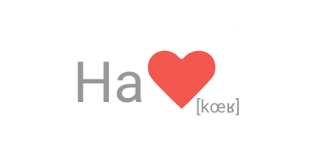

# Hackoeur - Android App
## Hackathon & Tech Conf Social App

### Description

Application developed for the CS385 project at Maynooth University, Ireland, by:
- Luc Dupuis
- Quentin Tardivon
- Ragul Sankar
- Asmita Belle

Design developed for the PD309 project Maynooth University, Ireland, by:
- Quentin Tardivon

### Development choices

- Kotlin for Android (https://developer.android.com/kotlin/index.html)
- MVP for Android (https://github.com/googlesamples/android-architecture/tree/dev-todo-mvp-kotlin/)

### Design

- Wireframe with Adobe UX Design (beta)
(https://xd.adobe.com/view/d818acc5-73d0-49c4-9d72-3a3fef58a1e0/)